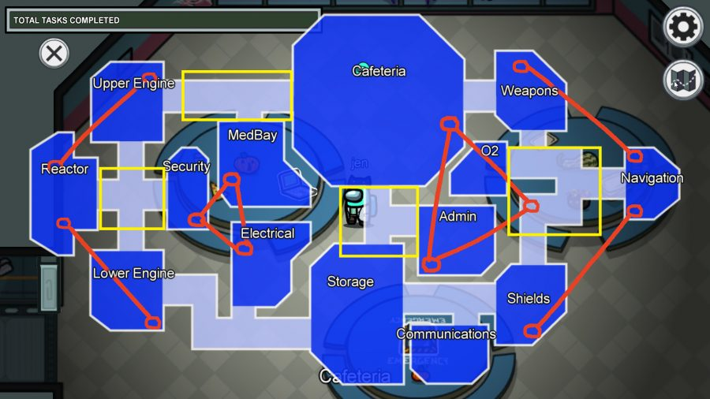

- [x] Introduce crew, at least Loona unnie line, maybe more of them, captain Haseul (green), each wearing their respective color.
- [x] establish Jungeun’s attraction to Sooyoung, who arrives late to the meeting.
- [x] Haseul tells them there is an imposter, and to keep watch.
- [x] Heejin is found dead in electrical during the shift change. Everyone is called for an emergency meeting.

Jungeun wakes up in a panic at the sound of the siren before being blinded by the flashing red light right above her bed. She covers her ears and squeezes her eyes shut, trying to orient herself. She pats around the table next to her bunk for her glasses and slips them on before standing, covering her ears again when the siren gets louder.

She dons her suit, as per protocol. Emergency meetings usually meant a breach somewhere in the hull. All hands on deck was necessary in those cases.

The siren is muffled by her helmet and Jungeun allows herself to relax as the sound fades from ugent to bearable. She triple checks the seals on her gloves and helmet before she presses the button to open the door to her room.

Once she's outside, she's met by a puzzled-looking Hyunjin, who hasn't bothered to put her helmet on. She rubs her eyes and frowns at Jungeun. "Any clue what this is about?"

Jungeun shrugs, still getting her bearings.

They make their way to the cafeteria together, where Haseul paces in front of the table where everyone else has gathered. No one else seems to know what's happening except Jinsol, who's frozen, eyes fixed on some imaginary point in the distance. She jumps when Hyunjin knocks into her as she slides onto the bench.

"What's up?" Jungeun asks.

Jinsol just shakes her head, eyes staring forward at nothing. The rest of the crew seem just a puzzled, glancing nervously at Jinsol and murmuring possibilities.

Haseul clears her throat and the uneasy muttering around the table stops. 

"I didn't think this would happen," She starts quietly, fiddling with the latch on her green suit, before she looks up at the crew and visibly steels herself, straightening her shoulders, and that's when Jungeun knows something bad has happened. "There's no easy way to say this. Heejin was found dead this morning during electrical shift change."

It takes a second to sink in, and then Jungeun watches Hyunjin fall to the floor, face slack with grief and horror. She sobs once, tight and horrible before she looks up at Haseul. "Let me see her."

Haseul shakes her head. "It's best for everyone if no one sees." 

Jungeun knows what that means. There's not enough left of Heejin *to* see. Her helmet is suddenly suffocating. She undoes the latch and drops her helmet into her lap, where the chrome detailing reflects the brilliant red of her suit. She fiddles the latch on the helmet absentmindedly as she studies the other crew member's faces. She’d known these people for weeks. There was no way that one of them could have—

"Report anything suspicious. If is you think it's nothing. This button is here for a reason." Haseul gestures to the bright red button under the plastic cover in the center of the table, and Jungeun can see the quiver in her hand. "We just need to get to the next docking station." The last part is quiet, like she's trying to convince herself.

Jungeun feels faint, and the skin on the back of her neck prickles. She feels watched. Like she could be the next target. She looks around at the rest of the crew. Jiwoo looks scared, and Jungeun doesn’t blame her. She knows what had happened to Jiwoo’s mom—how the company had said there wasn't enough to scrape off the walls to justify sending a box home. Jiwoo had lived with her family after that. Jungeun scoots closer to Jiwoo. She was the only person she could trust. She *knew* Jiwoo. She was practically her sister.

Then she's startled by the hydraulic hiss of the door from the engines. “Hey guys, sorry.” Sooyoung jogs in, pulling her helmet off and shaking out her dark hair, pushing some of it out of her face and smearing her cheek with motor oil in the process. It compliments her cheekbones, and Jungeun averts her eyes. Not the time. “The lower engine had a loose bolt clanging around in it. Could have been really dangerous.”

Haseul gestures for her to sit. “There's been a death.”

Sooyoung freezes. Then, slowly, she sinks into the nearest chair, eyes wide. "What? Who?"

"Heejin. Last night. It's," Haseul glances at everyone. No one likes the word. Jungeun knows Haseul doesn't want to say it. She doesn't have to.

Sooyoung nods, face grim. "I'll keep an eye out."

Haseul swallows. Shaking her head slowly. "We can make it to the station. Continue your tasks. I know it's going to be hard, but it's how we get there."

---

Jungeun kneels down next to Hyunjin after the meeting, resting a hand on her shoulder. Most of the crew has cleared out, but Haseul and Vivi linger, having a quiet conversation to the side, and Hyunjin and Jinsol remain frozen in place. "Can I help you stand?"

Jinsol watches the two of them from her seat at the table. She hasn't moved all meeting, just clenching and unclenching her jaw. Jungeun can see a smear of red on the toe of her bright blue suit. She rips her eyes away, feeling nauseous.

Instead, she tries to focus on Hyunjin, whose breathing hasn't settled, half breaths and half sobs. "Let's get you to the Med-bay—"

Hyunjin's eyes light up. "Yes—"

Vivi interrupts. "No. You're not permitted in the Med-bay until we've—" she clears her throat. There's no polite way to say 'dealt with the viscera.'

Jungeun feels Hyunjin's muscles coil, and that's how she knows to tighten her grip on her before Hyunjin can lunge at Vivi.

"Let me see her! I need to say goodbye!" Jungeun doesn't know if she's ever heard Hyunjin so emotional, her voice rough and choked up. Jungeun can hear the way she has to force the words out.

"Vivi," Jungeun starts. Maybe it *could* help—

"No." Vivi shakes her head. Then, softly, "Trust me."

Vivi turns away after that, and slinks out of the room quietly, leaving Haseul standing awkwardly at the door.

Jungeun relaxes her grip on Hyunjin, who slumps against Jungeun before finding her legs. "I need to clear her bunk. She needs," Hyunjin shrugs. "Her family should be sent something at least."

Jungeun nods. It's not her place. She hadn't known the two of them for long, but Heejin and Hyunjin had...orbited each other.

"Jungeun, walk with me." Haseul calls, beckoning her over.

Jungeun glances back at Jinsol, wondering it it's safe to leave her, but Haseul was captain, so she nods and follows. They're both silent on the quick walk to Admin.

Haseul speaks up when it's just the two of them. “We use rivets in the rear of the ship to prevent bolts from coming loose in the engine.” Her eyes shift uneasily to the doorway. “Anyway, I’m sure it could have been knocking around in someone’s pocket.” She looks at Jungeun meaningfully. "I need you to keep an eye out. Can I count on you?"

Jungeun nods, swallowing. "You can count on me."

---

The atmosphere of the ship changes. Of course it does. This was supposed to be a straightforward supply mission

- [ ] Jungeun becoming more paranoid, having suspicious run-ins with everyone on the ship

---

Hyunjin is in grief.

Haseul isn't where she's stationed when Jungeun goes to look for her, evasive when Jungeun asks her where she was.

Vivi is smuggling illegal cargo. Haseul wants to make an intermediate landing at a planet on the way to carry out a full investigation but Vivi refuses. (There is no extra fuel to leave the atmosphere to get back up into space. It has been replaced with the contraband.)

Jinsol is fudging the inventory numbers 

Jiwoo always seems to find Jungeun before Jungeun can find her.

Sooyoung...sus in general

Chaewon — Maybe an affair with Heejin? something she can't come clean about, doesn't want to sully Heejin's memory.
- Chaewon is on the cameras in the vicinity of Heejin's murder: "I was just passing by, I didn't see anything suspicious. That's my route to Navigation." The first one people suspect.

---

- [ ] Jungeun is caught on the security cameras moving quickly away from electrical when the lights go out suddenly, and Sooyoung lies for her with no explanation, sending Jungeun into a tailspin. "I radioed her because I needed a hand with some spot welding."

---

- Jungeun watches Sooyoung use Heejin's special screwdriver to tighten a knob on the nav panel while they're assigned repairs together. 
- "Where did you get that?" 
- "This?" 
- "It's Heejin's." 
- "Oh? I didn't know. I found this in the hallway and picked it up"
- Jungeun's skin prickles. It doesn't *feel* like a lie, but it also doesn't *not*. She stares at a fleck of blood on the handle.
- "Do you think Hyunjin will want to send it back to earth in the box?" Sooyoung stares at it too, holding it much more gingerly now.

---

- [ ] more suspicious run-ins with Sooyoung, reports them to Haseul, but feels guilty. She's trying to figure out why Sooyoung lied for her.

- [ ] Haseul is uncharacteristically tense. “You need to catch her in the act, Jungeun. I can’t do anything without proof.” Jungeun doesn't think Sooyoung did it, but she 'd rather have something to do to take her mind off of the danger, so she agrees to follow Sooyoung.

- [ ] Sooyoung shows up in electrical from the cafeteria impossibly fast. Jungeun doesn’t see her on the way over.
- [ ] Sooyoung hastily stuffs a dirty rag into her back pocket when Jungeun joins her in the upper engine, clearly startled and not prepared for company.
- [ ] Sooyoung: “you’re following me. why?”
- [ ] Jungeun can’t even call it a lie when she admits she is attracted to Sooyoung, they hook up.
- [ ] affair continues
- [ ] Jinsol accuses her of getting distracted. “Haseul told you to watch her, not fuck her.”
- [ ] Jungeun: “why don’t you do it, then?”
- [ ] Jinsol is avoidant, “I...have my own assignment.”

---

- [ ] Jiwoo is caught killing **Jinsol**, sent out of the airlock. Jungeun watches as her body bloats and explodes in the vacuum of space.
- [ ] After Jiwoo is booted, Hyunjin comes into Jungeun's room to comfort her even though it's clear Jiwoo killed Heejin. They’ve both lost someone. Jungeun kisses Hyunjin because her emotions are all over the place. Then pulls away when she hears shoes squeak right outside her open door. She sees a flash of maroon suit disappear around the corner. The next day, **Hyunjin** is dead.
- [ ] Jungeun ill with stress, goes to Sooyoung's bunk to decompress. She tries not to think about the flash of maroon hours before Hyunjin was killed.

---

- Unexpectedly, Chaewon is the most rocked by Hyunjin's death.

---

- [ ] Haseul is destroyed in the wake of Jiwoo. [plant hints that Jiwoo and Haseul might have been involved earlier]. She doesn’t sleep. Just paces the ship.
- [ ] Jungeun finds her hiding in storage when the lights go out. Jungeun doesn't know if it's sabotage or due to one of their electrical team being dead. 
- [ ] “I should have done something. It’s my fault.”
- [ ] Jungeun stares at her, slow realization creeping in, “Haseul did you…know that Jiwoo was—”
- [ ] Haseul stares up at her, eyes hollow. She doesn’t need to say anything at all.
- [ ] The next day, she silently passes her captain’s rank to Vivi.
- [ ] Chaewon asks Jungeun what happened. Jungeun just shakes her head.

---

- [ ] Sooyoung is accused of being an imposter again, she brushes it off with, "I was in the shower and couldn't hear my device." Jungeun knows she's right—she was in there with her, but her defense gets caught in her throat and she avoids Sooyoung's eyes when she stares at her, waiting for her to speak up.
- [ ] Jungeun could lie to herself—claim she doesn't care how dangerous Sooyoung might be, doesn't care that every time they meet she could be inches from death—but the truth is worse. She knows it by the crawling heat beneath her skin. Sooyoung's danger makes it better.
- [ ] Jungeun falling for Sooyoung, defending her when Haseul wants to send her out of the airlock.
- [ ] Haseul confronting her afterwards. "You know it's her just as much as I do."

---

- Jungeun confronts Chaewon about being in electrical regularly. "You're always here. What? Returning to the scene of the crime?"
- Chaewon stares at her, horrified before denying it. "It's not like that. It's...I miss her." Avoidant. "I think it was my fault. I wasn't in security, and she was here much later than she should have—"
- Jungeun understands.

---

- [ ] **Chaewon** is discovered. Jungeun doesn't have a chance of denying it's her. Sooyoung catches her with blood on her hands.

Sooyoung scrambles back after Jungeun removes her helmet. “You’re not Jungeun.”

Jungeun steps towards her, eyes zeroing in on Sooyoung’s neck, pulse clear and rapid under her skin. “Yes, I am.”

//TODO Figure out exact ending. Jungeun sent out of airlock.